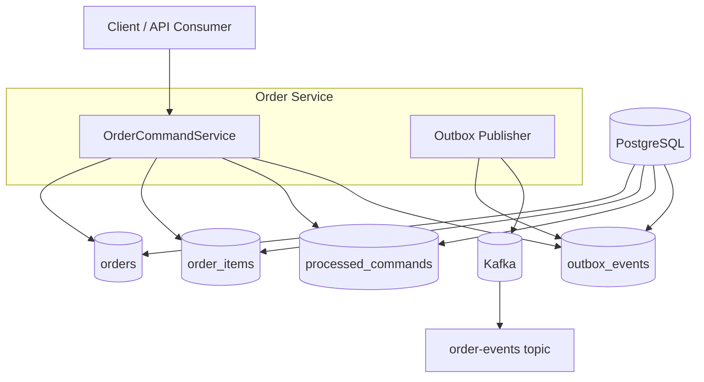
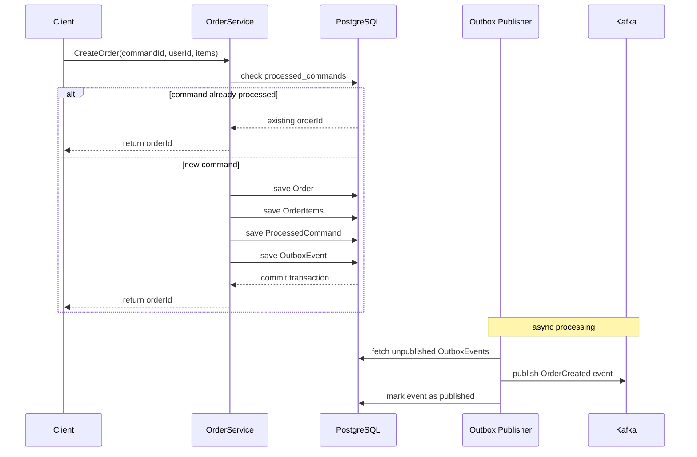

# Order Service

Order Service — это центральный сервис в системе управления заказами (Order Management System).
Он отвечает за создание заказов, обеспечение идемпотентности команд и надёжную публикацию доменных событий
в Kafka с использованием **Outbox Pattern**.

Сервис реализован с прицелом на production-подходы и покрыт интеграционными тестами
с использованием **Testcontainers**.

---

## 📌 Responsibilities

Order Service отвечает за:

- создание заказов (Create Order)
- расчёт общей стоимости заказа
- обеспечение идемпотентности команд
- генерацию доменных событий (`OrderCreated`)
- надёжную доставку событий через Outbox Pattern
- публикацию событий в Kafka

Сервис **не занимается**:
- резервированием товаров
- оплатами
- оркестрацией бизнес-процесса (Saga)

---

## 🧱 Architecture Overview



### Ключевая идея
Состояние заказа и событие сохраняются **в одной транзакции**, а публикация в Kafka
выполняется асинхронно, что устраняет проблему dual-write.

---

## 🔁 Create Order Flow

1. Клиент отправляет команду `CreateOrder`
2. Проверяется `commandId` (идемпотентность)
3. Создаётся заказ и позиции заказа
4. В одной транзакции сохраняются:
    - `Order`
    - `OrderItems`
    - `ProcessedCommand`
    - `OutboxEvent`
5. Транзакция коммитится
6. Outbox Publisher публикует событие в Kafka
7. Событие становится доступным другим сервисам


---

## 🧠 Key Patterns Used

### Idempotent Command Handling
Каждая команда имеет уникальный `commandId`.
Это позволяет безопасно обрабатывать повторные запросы
(например, при retry на стороне клиента).

### Outbox Pattern
События сохраняются в таблицу `outbox_events` в рамках транзакции с бизнес-данными,
а затем асинхронно публикуются в Kafka.

Это гарантирует:
- отсутствие потери событий
- устойчивость к сбоям Kafka
- корректную работу при рестартах сервиса

### Anemic Domain Model
На текущем этапе используется анемичная модель домена
с фокусом на чистую архитектуру и инфраструктурную надёжность.

---

## 🧪 Testing Strategy

Сервис покрыт **integration tests**, которые проверяют реальные сценарии работы.

Используется:
- PostgreSQL Testcontainers
- Kafka Testcontainers
- Flyway migrations
- Hibernate schema validation

### Что тестируется:
- создание заказа
- идемпотентность команд
- корректность persistence layer
- запись событий в outbox
- публикация событий в Kafka

Тесты не используют моки и работают с реальной инфраструктурой,
что максимально приближено к production-среде.

---

## 🚀 How to Run

### Prerequisites
- Java 21+
- Docker

### Run tests
```bash
./mvnw clean test
```

---

## 📎 Tech Stack

- Java
- Spring Boot
- Spring Data JPA
- PostgreSQL
- Flyway
- Apache Kafka
- Testcontainers
- Awaitility
- Maven
